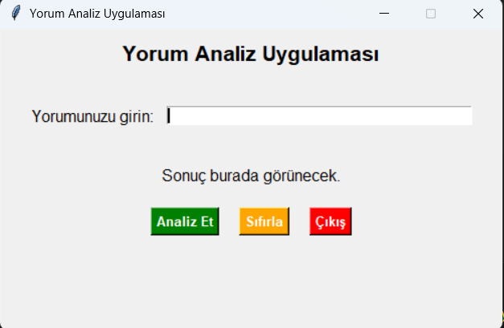
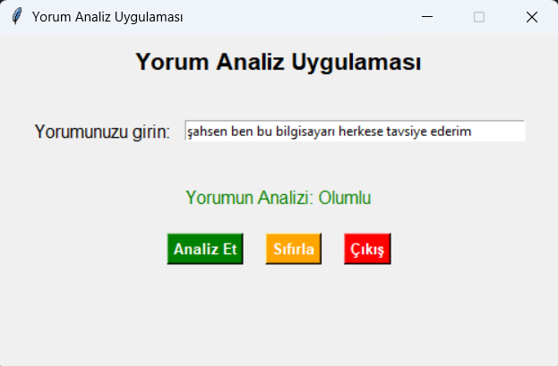
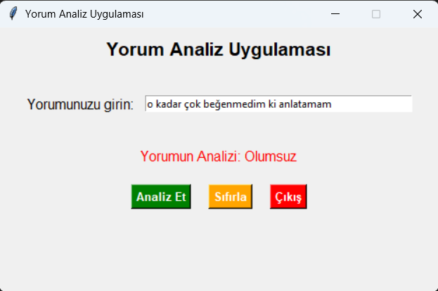

# 📝 Yorum Analizi - Doğal Dil İşleme Uygulaması

Bu proje, online pazar yerlerinden alınan kullanıcı yorumlarını analiz ederek **olumlu** veya **olumsuz** olarak sınıflandıran bir **Doğal Dil İşleme (NLP)** uygulamasıdır.

## 🚀 Proje Özellikleri
- Kullanıcıların girdiği yorumları analiz ederek **olumlu** veya **olumsuz** sonucunu verir.
- **Makine Öğrenmesi** modeli ile eğitilmiştir.
- **Tkinter** ile geliştirilmiş basit ve kullanıcı dostu bir arayüze sahiptir.
- Model, **tokenization** ve **word frequency** yaklaşımı ile oluşturuldu.

## 🖼 Arayüz Görselleri
| Ana Ekran | Olumlu Yorum | Olumsuz Yorum |
|-----------|-------------|--------------|
|  |  |  |

## 🔍 Kullanılan Teknolojiler
- **Python**
- **Tkinter** (GUI)
- **NLP / Tokenization**
- **Sklearn**
